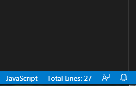

# Total Lines VSCode Extension

This extension will show the total number of lines in status bar right-bottom of your VSCode editor. This a simple extension, for quickly show the total number of lines in the active file.

## Known Issues

None.

## Release Notes

### 1.0.0

**Enjoy!**
